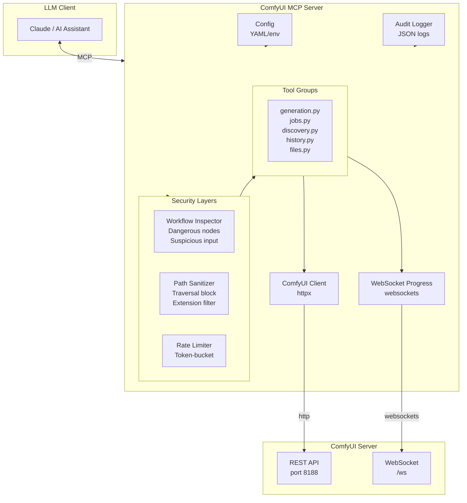

# comfyui-mcp

A secure MCP (Model Context Protocol) server for [ComfyUI](https://github.com/comfyanonymous/ComfyUI). Enables AI assistants like Claude to generate images, run workflows, and manage jobs through ComfyUI — with built-in security controls that existing ComfyUI MCP servers lack.

## Why this exists

Every existing ComfyUI MCP server is a thin passthrough to ComfyUI's API with no security guardrails. They allow arbitrary workflow execution (including malicious custom nodes that run `eval`/`exec`), have no input validation, no file path sanitization, no rate limiting, and no audit trail.

This server adds five security layers between the AI assistant and ComfyUI:

| Layer | What it does |
|-------|-------------|
| **Workflow Inspector** | Parses every workflow before execution, extracts node types, flags dangerous patterns (`eval`, `exec`, `__import__`, `subprocess`). Configurable audit-only or enforcement mode. |
| **Path Sanitizer** | Validates all filenames, subfolders, and URL path segments — blocks path traversal (`../`), null bytes, percent-encoded attacks, absolute paths, and disallowed file extensions. |
| **Rate Limiter** | Token-bucket rate limiting per tool category to prevent runaway loops. |
| **Audit Logger** | Structured JSON logging of every operation with automatic redaction of sensitive fields (tokens, passwords). |
| **Selective API Surface** | Only exposes safe ComfyUI endpoints. Dangerous endpoints (`/userdata`, `/free`, `/users`, `/system_stats`) are never proxied. |

### Real-time progress tracking

When `wait=True` is passed to `generate_image` or `run_workflow`, the server connects to ComfyUI's WebSocket to track execution in real time — reporting step progress, current node, and output files when complete. If the WebSocket connection fails, it automatically falls back to HTTP polling. Use `get_progress` to check status of any job at any time.

## Quick start

### Prerequisites

- Python 3.12+
- [uv](https://docs.astral.sh/uv/) package manager
- A running ComfyUI instance (local or remote)

### Install

**Option A: From source (recommended for development)**

```bash
git clone https://github.com/hybridindie/comfyui_mcp.git
cd comfyui_mcp
uv sync
```

**Option B: Docker (no clone required)**

```bash
docker pull ghcr.io/hybridindie/comfyui-mcp:latest
```

Or build locally from the repo:

```bash
docker build -t comfyui-mcp .
```

### Configure

Create a minimal config for your ComfyUI instance:

```bash
mkdir -p ~/.comfyui-mcp
cat > ~/.comfyui-mcp/config.yaml << 'EOF'
comfyui:
  url: "http://127.0.0.1:8188"
EOF
```

For a remote server:

```bash
cat > ~/.comfyui-mcp/config.yaml << 'EOF'
comfyui:
  url: "https://your-gpu-server:8188"
EOF
```

### Add to Claude Code / Claude Desktop

The MCP server communicates over stdio. Add one of the following configurations depending on how you installed.

**From source (uv):**

```json
{
  "mcpServers": {
    "comfyui": {
      "command": "uv",
      "args": ["--directory", "/path/to/comfyui_mcp", "run", "comfyui-mcp"]
    }
  }
}
```

**Docker (GitHub Container Registry):**

```json
{
  "mcpServers": {
    "comfyui": {
      "command": "docker",
      "args": [
        "run", "--rm", "-i",
        "-e", "COMFYUI_URL=http://host.docker.internal:8188",
        "-v", "~/.comfyui-mcp:/root/.comfyui-mcp:ro",
        "ghcr.io/hybridindie/comfyui-mcp:latest"
      ]
    }
  }
}
```

> **Note:** `host.docker.internal` routes to your host machine from inside Docker. If ComfyUI runs on a remote server, replace with that server's URL. On Linux, you may need to add `--add-host=host.docker.internal:host-gateway`.

### Verify

```bash
# From source
uv run python -c "from comfyui_mcp.server import mcp; print(f'Server {mcp.name!r} ready')"

# Docker
docker run --rm ghcr.io/hybridindie/comfyui-mcp:latest --help
```

## Tools

### Generation & Workflows

| Tool | Description |
|------|-------------|
| `generate_image` | Text-to-image using a built-in workflow. Params: prompt, negative_prompt, width, height, steps, cfg, model. Set `wait=True` to block until complete and return outputs. |
| `run_workflow` | Submit arbitrary ComfyUI workflow JSON. Inspected for dangerous nodes before execution. Set `wait=True` to block until complete and return outputs. |
| `summarize_workflow` | Summarize a workflow's structure, data flow, models, and parameters. |
| `create_workflow` | Create a workflow from a template (txt2img, img2img, upscale, inpaint, txt2vid_animatediff, txt2vid_wan) with parameter overrides. |
| `modify_workflow` | Apply batch operations (add_node, remove_node, set_input, connect, disconnect) to a workflow. |
| `validate_workflow` | Validate workflow structure, server compatibility, and security. |

### Job Management

| Tool | Description |
|------|-------------|
| `get_queue` | Get current execution queue state. |
| `get_job` | Check status of a job by prompt_id. |
| `cancel_job` | Cancel a running or queued job. |
| `interrupt` | Interrupt the currently executing workflow. |
| `get_queue_status` | Get detailed queue status including running and pending prompts. |
| `clear_queue` | Clear pending and/or running items from the queue. |
| `get_progress` | Get execution progress for a workflow by prompt_id. Returns status, queue position, and outputs. |

### Discovery

| Tool | Description |
|------|-------------|
| `list_models` | List available models by folder (checkpoints, loras, vae, etc.). |
| `list_nodes` | List all available node types. |
| `get_node_info` | Get detailed info about a specific node type. |
| `list_workflows` | List saved workflow templates. |
| `list_extensions` | List available ComfyUI extensions. |
| `get_server_features` | Get ComfyUI server features and capabilities. |
| `list_model_folders` | List available model folder types. |
| `get_model_metadata` | Get metadata for a specific model file. |
| `audit_dangerous_nodes` | Scan all installed nodes to identify potentially dangerous ones. |

### History

| Tool | Description |
|------|-------------|
| `get_history` | Browse execution history (read-only). |

### File Operations

| Tool | Description |
|------|-------------|
| `upload_image` | Upload a base64-encoded image to ComfyUI's input directory. Path-sanitized. |
| `get_image` | Download a generated image. Returns base64-encoded data URI. Path-sanitized. |
| `list_outputs` | List generated output filenames from history. |
| `upload_mask` | Upload a mask image to ComfyUI's input directory. Path-sanitized. |
| `get_workflow_from_image` | Extract embedded workflow and prompt metadata from a ComfyUI-generated PNG. |

### Deliberately not exposed

These ComfyUI endpoints are **never** proxied due to security risks:

- `/userdata` — arbitrary file read/write
- `/free` — unload models (DoS vector)
- `/users` — user management
- `/history` POST — delete history
- `/system_stats` — unnecessary information disclosure

## Configuration

Config file: `~/.comfyui-mcp/config.yaml`

```yaml
comfyui:
  url: "http://127.0.0.1:8188"   # ComfyUI server URL
  tls_verify: true                 # TLS certificate verification
  timeout_connect: 30              # Connection timeout (seconds)
  timeout_read: 300                # Read timeout (seconds)

security:
  mode: "audit"                    # "audit" (log only) or "enforce" (block unapproved)
  allowed_nodes: []                # Enforce mode: only these nodes can run
  dangerous_nodes:                 # Always flagged in audit log (showing subset)
    - "Terminal"                   # comfyui-colab: shell via subprocess
    - "interpreter_tool"           # comfyui_LLM_party: exec/eval
    - "KY_Eval_Python"             # ComfyUI-KYNode: exec Python
    - "Image Send HTTP"            # was-node-suite: arbitrary HTTP
    - "Load Text File"             # was-node-suite: reads arbitrary files
    - "Save Text File"             # was-node-suite: writes arbitrary files
    # ... see config.py _DEFAULT_DANGEROUS_NODES for the full list
  max_upload_size_mb: 50
  allowed_extensions:
    - ".png"
    - ".jpg"
    - ".jpeg"
    - ".webp"
    - ".gif"
    - ".json"

rate_limits:                       # Requests per minute
  workflow: 10
  generation: 10
  file_ops: 30
  read_only: 60

logging:
  audit_file: "~/.comfyui-mcp/audit.log"

transport:
  sse:
    enabled: false
    host: "127.0.0.1"
    port: 8080
```

### Environment variables

Environment variables override config file values:

| Variable | Overrides |
|----------|-----------|
| `COMFYUI_URL` | `comfyui.url` |
| `COMFYUI_TLS_VERIFY` | `comfyui.tls_verify` |
| `COMFYUI_TIMEOUT_CONNECT` | `comfyui.timeout_connect` |
| `COMFYUI_TIMEOUT_READ` | `comfyui.timeout_read` |
| `COMFYUI_SECURITY_MODE` | `security.mode` |
| `COMFYUI_AUDIT_FILE` | `logging.audit_file` |

## Security modes

### Audit mode (default)

Every workflow is inspected and logged, but nothing is blocked. Use this during development to understand what nodes your workflows use.

```yaml
security:
  mode: "audit"
```

Audit log entries look like:

```json
{
  "timestamp": "2026-02-25T14:30:00+00:00",
  "tool": "run_workflow",
  "action": "inspected",
  "nodes_used": ["KSampler", "CLIPTextEncode", "VAEDecode", "SaveImage"],
  "warnings": []
}
```

When a dangerous node is detected, warnings are included in the tool response:

```
Workflow submitted. prompt_id: abc123

⚠️ Warnings detected:
  - Dangerous node type: ExecutePython
  - Suspicious input in node 5 (ExecutePython), field 'code'
```

The MCP instructions tell the LLM to inform users and ask for confirmation before proceeding when warnings are present.

### Building your dangerous node list

Use the `audit_dangerous_nodes` tool to scan your ComfyUI installation for potentially dangerous nodes:

| Tool | Description |
|------|-------------|
| `audit_dangerous_nodes` | Scans all installed nodes and returns dangerous/suspicious ones with reasons |

Run this once to see what dangerous nodes are installed:

```
audit_dangerous_nodes() → {
  "total_nodes": 456,
  "dangerous": {
    "count": 12,
    "nodes": [
      {"class": "ExecutePython", "reason": "Name matches pattern: \\bexec\\b"},
      {"class": "RunPython", "reason": "Name matches pattern: \\brunpython\\b"},
      {"class": "ShellCommand", "reason": "Name matches pattern: \\bshell\\b"}
    ]
  },
  "suspicious": {...}
}
```

Add these to your config:

```yaml
security:
  mode: "audit"
  dangerous_nodes:
    - "ExecutePython"      # from audit_dangerous_nodes
    - "RunPython"
    - "ShellCommand"
    # ... other nodes found by audit
```

### Enforce mode

Only explicitly approved nodes can run. Any workflow containing an unapproved node is rejected.

```yaml
security:
  mode: "enforce"
  allowed_nodes:
    - "KSampler"
    - "CheckpointLoaderSimple"
    - "CLIPTextEncode"
    - "VAEDecode"
    - "EmptyLatentImage"
    - "SaveImage"
    - "LoadImage"
    - "LoraLoader"
```

**Tip:** Use `audit_dangerous_nodes` to identify dangerous nodes, run workflows in audit mode to see which nodes you use, then switch to enforce mode with that allowlist.

## Audit log

All tool invocations are logged as JSON lines to `~/.comfyui-mcp/audit.log`:

```bash
# Watch the audit log in real time
tail -f ~/.comfyui-mcp/audit.log | python -m json.tool

# Find all workflows that used dangerous nodes
grep '"warnings":\[' ~/.comfyui-mcp/audit.log | grep -v '"warnings":\[\]'
```

Sensitive fields (`token`, `password`, `secret`, `api_key`, `authorization`) are automatically redacted from log entries.

## Security

### Threat model

| Threat | Impact | Mitigation |
|--------|--------|------------|
| Arbitrary code execution via workflow nodes | Critical | Workflow inspector (audit/enforce mode) |
| Path traversal via file operations | High | Path sanitizer blocks `..`, null bytes, encoded attacks, absolute paths |
| Denial of service via request flooding | Medium | Token-bucket rate limiter per tool category |
| Credential leakage in logs | Medium | Automatic redaction of `token`, `password`, `secret`, `api_key`, `authorization` |
| Information disclosure via API | Low | Dangerous endpoints (`/userdata`, `/free`, `/system_stats`) never proxied |
| MITM on ComfyUI connection | Medium | Configurable TLS verification |

### Security controls by component

**Workflow Inspector** (`security/inspector.py`)
- Parses workflow JSON, extracts node types, checks against configurable blocklist
- Recursive pattern matching for `__import__()`, `eval()`, `exec()`, `os.system()`, `subprocess` in all input values (including nested dicts/lists)
- Audit mode: logs warnings, allows execution. Enforce mode: blocks unapproved nodes
- Limitation: static blocklist can be bypassed with obfuscation or unknown custom nodes

**Path Sanitizer** (`security/sanitizer.py`)
- Validates filenames, subfolders, and URL path segments: blocks path traversal, null bytes, absolute paths, control characters
- URL path segment validation on discovery tools (`list_models`, `get_model_metadata`) prevents folder/filename injection
- Allowlist-based extension filtering (default: `.png`, `.jpg`, `.jpeg`, `.webp`, `.gif`, `.json`)
- Handles percent-encoded inputs (URL decoding before validation)
- Enforces max upload size (default 50MB), max filename length (255 chars)

**Rate Limiter** (`security/rate_limit.py`)
- Token-bucket per tool category: workflow (10/min), generation (10/min), file_ops (30/min), read_only (60/min)
- In-memory only (resets on restart, no distributed support)

**HTTP Client** (`client.py`)
- Configurable TLS verification, connect/read timeouts
- Retries on connection errors with backoff (3 retries default). HTTP 4xx/5xx errors raised immediately (no retry)

**WebSocket Progress** (`progress.py`)
- On-demand WebSocket connections for real-time execution tracking (step progress, current node, outputs)
- Automatic HTTP polling fallback if WebSocket connection fails
- TLS/SSL passthrough for secure ComfyUI connections
- Per-prompt event filtering (ignores events from other concurrent jobs)

**Configuration** (`config.py`)
- `yaml.safe_load` only, env var overrides limited to specific keys, Pydantic type validation

### Production deployment

For production, run behind a reverse proxy (nginx, Traefik) to add TLS termination, authentication, and CSP headers. No PII is collected. No external telemetry.

## Architecture



### Components

| Component | File | Responsibility |
|-----------|------|----------------|
| Server | `server.py` | Entry point, wires components, registers tools |
| Config | `config.py` | Pydantic settings, YAML loading, env overrides |
| Client | `client.py` | Async HTTP client for ComfyUI REST API |
| Progress | `progress.py` | WebSocket progress tracking with HTTP polling fallback |
| Audit | `audit.py` | Structured JSON logging with redaction |
| Workflow Inspector | `security/inspector.py` | Node type detection, dangerous pattern matching |
| Node Auditor | `security/node_auditor.py` | Scans installed nodes for dangerous patterns |
| Path Sanitizer | `security/sanitizer.py` | Path traversal, extension filtering |
| Rate Limiter | `security/rate_limit.py` | Token-bucket per tool category |

## Development

### Project structure

```text
src/comfyui_mcp/
├── server.py              # MCP server entry point, wires all components
├── config.py              # Pydantic settings, YAML loading, env overrides
├── client.py              # Async HTTP client for ComfyUI API
├── progress.py            # WebSocket progress tracking with HTTP polling fallback
├── audit.py               # Structured JSON audit logger
├── security/
│   ├── inspector.py       # Workflow node inspection (audit/enforce)
│   ├── node_auditor.py    # Scans installed nodes for dangerous patterns
│   ├── sanitizer.py       # File path validation
│   └── rate_limit.py      # Token-bucket rate limiter
├── workflow/
│   ├── templates.py       # Built-in workflow templates (txt2img, img2img, upscale, etc.)
│   ├── operations.py      # Workflow graph operations (add/remove nodes, connect, etc.)
│   └── validation.py      # Workflow analysis and validation
└── tools/
    ├── generation.py      # generate_image, run_workflow, summarize_workflow
    ├── workflow.py         # create_workflow, modify_workflow, validate_workflow
    ├── jobs.py            # get_queue, get_job, cancel_job, interrupt, get_progress
    ├── discovery.py       # list_models, list_nodes, audit_dangerous_nodes, etc.
    ├── history.py         # get_history
    └── files.py           # upload_image, get_image, list_outputs, upload_mask, get_workflow_from_image
```

### Run tests

```bash
uv sync
uv run pytest -v
```

## Docker

A pre-built Docker image is published to the GitHub Container Registry. No need to clone the repo.

```bash
docker pull ghcr.io/hybridindie/comfyui-mcp:latest
```

### How it works

The container runs `uv run comfyui-mcp` as its entrypoint, communicating over stdin/stdout (stdio). This makes it compatible with Claude Code, Claude Desktop, and any MCP client. Config is read from `/root/.comfyui-mcp/config.yaml` inside the container — mount your local config directory to provide it, or use environment variables.

### Running standalone

```bash
# Using the hosted image
docker run --rm -i \
  -e COMFYUI_URL=http://host.docker.internal:8188 \
  -v ~/.comfyui-mcp:/root/.comfyui-mcp:ro \
  ghcr.io/hybridindie/comfyui-mcp:latest

# Or build and run locally
docker build -t comfyui-mcp .
docker run --rm -i \
  -e COMFYUI_URL=http://host.docker.internal:8188 \
  -v ~/.comfyui-mcp:/root/.comfyui-mcp:ro \
  comfyui-mcp
```

> **Linux users:** Add `--add-host=host.docker.internal:host-gateway` if using `host.docker.internal`.

### Docker Compose

A `docker-compose.yml` is included for persistent deployments:

```bash
# Start
COMFYUI_URL=http://your-comfyui:8188 docker compose up -d

# View logs
docker compose logs -f comfyui-mcp
```

The compose file mounts `./config.yaml` and persists audit logs to a named volume:

```yaml
services:
  comfyui-mcp:
    build: .
    image: comfyui-mcp:latest
    container_name: comfyui-mcp
    environment:
      - COMFYUI_URL=${COMFYUI_URL:-http://comfyui:8188}
      - COMFYUI_SECURITY_MODE=${COMFYUI_SECURITY_MODE:-audit}
    volumes:
      - ./config.yaml:/root/.comfyui-mcp/config.yaml:ro
      - comfyui-mcp-data:/root/.comfyui-mcp/logs
    restart: unless-stopped

volumes:
  comfyui-mcp-data:
```

### Connecting to Claude Code / Claude Desktop via Docker

See the [Docker configuration](#add-to-claude-code--claude-desktop) in Quick Start above. The key points:

- Use `docker run --rm -i` (interactive, no detach) so stdio works
- Mount your config: `-v ~/.comfyui-mcp:/root/.comfyui-mcp:ro`
- Set `COMFYUI_URL` to reach your ComfyUI instance from inside the container
- Use `host.docker.internal` to reach ComfyUI running on your host machine
- The GHCR image (`ghcr.io/hybridindie/comfyui-mcp:latest`) means no local build needed

## License

MIT
