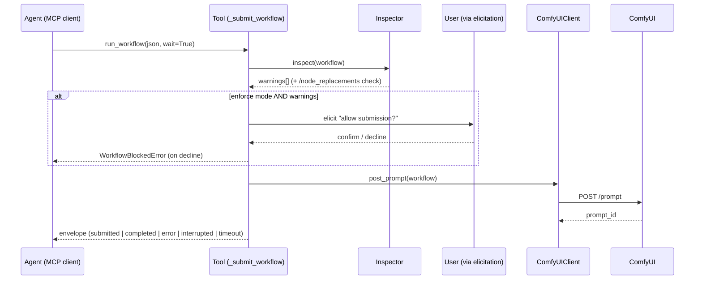

# Workflow pipeline

Every workflow-submitting tool funnels through `_submit_workflow` — one
chokepoint means no tool can forget a step.

## The sequence



## What the inspector checks

1. **Dangerous nodes** — curated list (~150 real `class_type`s in three
   categories: code execution, network access, filesystem access) plus
   regex name-pattern matching for unknown packages
2. **Suspicious inputs** — recursive matching for `__import__()`, `eval()`,
   `exec()`, `os.system()`, `subprocess` across all input values
3. **Server-side replacements** — `/node_replacements` map consulted so a
   node that will be rewritten server-side is known *before* submission
   (recursing into subgraphs)
4. **Subgraph recursion** — embedded subgraph node maps are inspected too;
   unexpanded references produce an explicit "cannot fully inspect" warning

## What the validator adds

`comfyui_validate_workflow` runs the inspector's checks plus structural
analysis:

- graph structure and broken links (V3-schema-aware link detection —
  `DynamicCombo` values are not links)
- server compatibility
- **loop integrity** — pairing/escape/accumulate rules mirroring ComfyUI's
  own `validate_loops`: `loop_end_without_start`, `loop_start_without_end`,
  `ambiguous_loop_nesting`, `loop_escape`, `loop_accumulate_from_body`.
  Zero cost when no loop nodes exist.

## The wait envelope

All workflow/generation tools return a uniform dict:

```json
{
  "status": "completed",
  "prompt_id": "b0f6...e21",
  "outputs": [{...}],
  "elapsed_seconds": 14.2,
  "step": 20, "total_steps": 20,
  "warnings": []
}
```

`status` is one of `submitted` / `completed` / `interrupted` / `error` /
`timeout`. `warnings` travels with every result — in audit mode it is the
whole security story; in enforce mode it is what elicitation already asked
about.

## Partial execution

`comfyui_run_workflow` / `comfyui_run_workflow_stream` accept an optional
`partial_execution_targets` list — re-run just those nodes, serving the rest
from the server's execution cache. Node IDs are validated locally before
submit; an empty list is rejected; the key is omitted from the request body
when unset so the historical wire shape doesn't change.