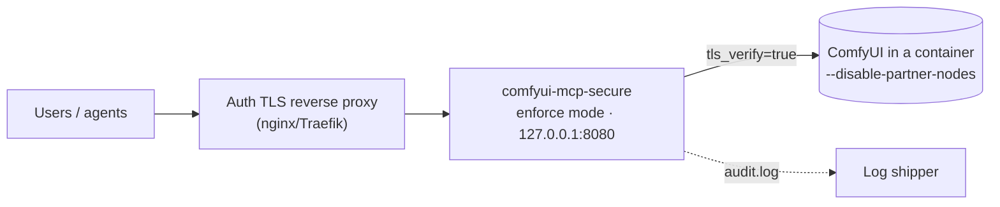

# Run securely in production

The default configuration optimizes for "works on my desktop". Production
changes four things: mode, transport, containment, and log practice.

## 1. Switch to enforce mode

Audit mode assumes you'll read warnings and behave. Don't assume on a
shared host:

```yaml
security:
  mode: "enforce"
  allowed_nodes:
    - "KSampler"
    - "CheckpointLoaderSimple"
    - "CLIPTextEncode"
    - "VAEDecode"
    - "EmptyLatentImage"
    - "SaveImage"
```

Build the allowlist from evidence, not vibes:

1. `comfyui_audit_dangerous_nodes` — find what's dangerous in *your*
   installed set
2. Run your real workloads in audit mode for a while
3. `grep '"nodes_used"' ~/.comfyui-mcp/audit.log | sort | uniq -c` — what
   do you actually use?
4. Paste that list. The
   [elicitation gate](./security-enforce-mode.md) then covers everything the
   list missed.

## 2. Transport discipline

- Keep Streamable HTTP on `127.0.0.1` unless behind an **authenticated TLS
  reverse proxy** (nginx/Traefik: TLS termination + auth + CSP)
- Keep `tls_verify: true` for remote ComfyUI hosts — disabling it is a
  deliberate, documented choice, not a fix
- The MCP server performs no auth itself; the proxy layer is the access
  control

## 3. Containment outside the server

The inspector is static analysis — not a sandbox. For hosts that matter:

- Run ComfyUI itself in a container (filesystem/network isolation)
- One MCP server process per tenant — the audit log and rate limiter are
  per-process; nothing here arbitrates between users
- `--offline` (ComfyUI v0.38+) if no outbound network is acceptable;
  `--disable-partner-nodes` to gate third-party API nodes

## 4. Audit-log practice

```bash
# Follow live
tail -f ~/.comfyui-mcp/audit.log | python -m json.tool

# Dangerous-node usage over time
grep '"warnings":\[' ~/.comfyui-mcp/audit.log | grep -v '"warnings":\[\]'

# The server's capability claim at startup (per run)
grep '"action":"server_features"' ~/.comfyui-mcp/audit.log
```

The log answers "what did the agent run, when, with what?" — wire it into
whatever log shipper you already run. Retention and shipping are yours;
secrets are already redacted.

## What production looks like



The threat rows and residual risks are catalogued in the
[threat model](./security-threat-model.md).