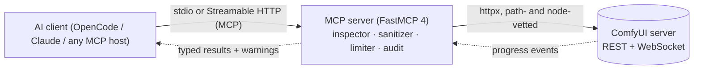

## The path an image takes

Every generation crosses three hops — each one inspected, sanitized, and logged:



The server is a gatekeeper, not a proxy: it understands the workflow JSON it
forwards, warns on dangerous nodes, and refuses endpoints it does not trust.

## The security surface in one example

Submit a workflow containing a code-execution node:

```text
> comfyui_validate_workflow(workflow='{"nodes": {"5": {"class_type": "ExecutePython", ...}}}')

{ "valid": true, "errors": [],
  "warnings": [{ "type": "dangerous_node",
                 "node": "5", "class_type": "ExecutePython",
                 "reason": "code execution node" }] }
```

In audit mode the submission proceeds and the warning lands in the audit log.
In enforce mode the server **asks the user to confirm before anything runs**
(MCP elicitation) — a decline blocks the submission without calling ComfyUI.
That gate is the tool's own behavior, not the client's discretion.

Run it yourself: [getting started](./getting-started.md) — the full security
model is pinned by invariant tests.

> [!WARNING]
> **Security is enforced server-side.** An MCP client that ignores warnings
> cannot bypass enforce mode or the elicitation gate — blocking happens inside
> the server. The docs' [threat model](./security-threat-model.md) covers what
> each control does and does not defend against.

---

## Where to go next

- **[What & why](./what-why.md)** — the reasoning behind every major design decision
- **[Core concepts](./concepts.md)** — the vocabulary the rest of the docs assume
- **[Security model](./security-model.md)** — the six controls and how they compose
- **[Architecture](./architecture/.md)** — the server, the client, the workflow pipeline
- **[Reference](./reference.md)** — every tool, resource, config knob, env var
- **[Guides](./guides-generate.md)** — generate images, author workflows, deploy in production